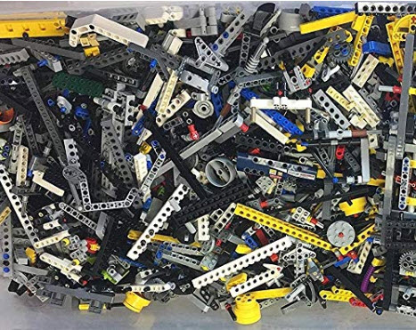
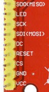

# Lego Hat
For FLL Events

# Parts

Foam:<br>
https://www.amazon.com/gp/product/B00069PFKK

Motors:<br>
https://www.amazon.com/gp/product/B00VUC7MQW

Motor Controller:<br>
https://www.adafruit.com/product/4280

Gears:<br>
https://www.amazon.com/gp/product/B01LVXYZ9L

Small Displays:<br>
2.2" TFT LCD Display Module Board 240x320 For ILI9341 51 AVR STM32 ARM Z2L8

https://www.amazon.com/HiLetgo-4-Wire-Display-240x320-ILI9341/dp/B01CZL6QIQ

Mat:<br>
https://www.amazon.com/gp/product/B00U7U1SHW<br>


Lego Tape:<br>
https://www.amazon.com/gp/product/B07L34F5VY<br>


Technic Parts:<br>
https://www.amazon.com/gp/product/B07TJTTTY5<br>


# Construction


```
sudo pip3 install adafruit-circuitpython-motorkit

from adafruit_motorkit import MotorKit
kit = MotorKit()

kit.motor1.throttle = 1.0
kit.motor3.throttle = 1.0

```

# Displays

https://learn.adafruit.com/micropython-hardware-ili9341-tft-and-featherwing/tdicola-overview


