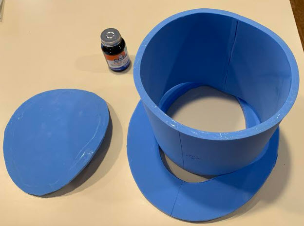
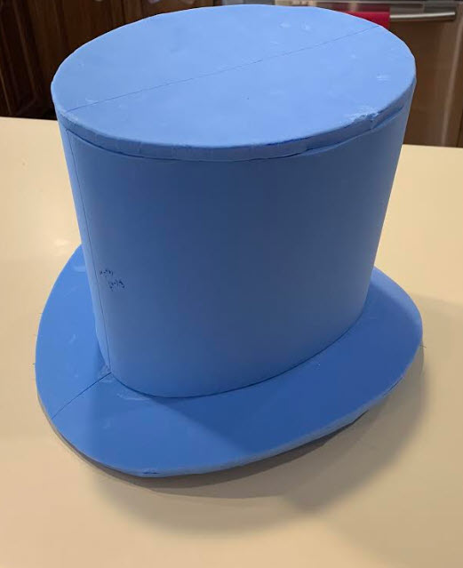
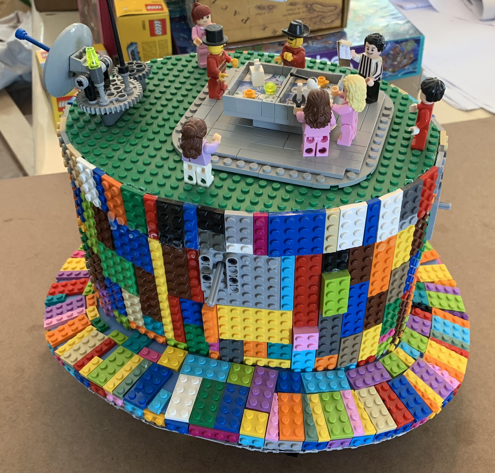

# Lego Hat
For FLL Events

# Parts

Foam:<br>
https://www.amazon.com/gp/product/B00069PFKK

Motors:<br>
https://www.amazon.com/gp/product/B00VUC7MQW

Motor Controller:<br>
https://www.adafruit.com/product/4280

# Construction





```
sudo pip3 install adafruit-circuitpython-motorkit

from adafruit_motorkit import MotorKit
kit = MotorKit()

kit.motor1.throttle = 1.0
kit.motor3.throttle = 1.0

```

# Schematics


# Pictures




